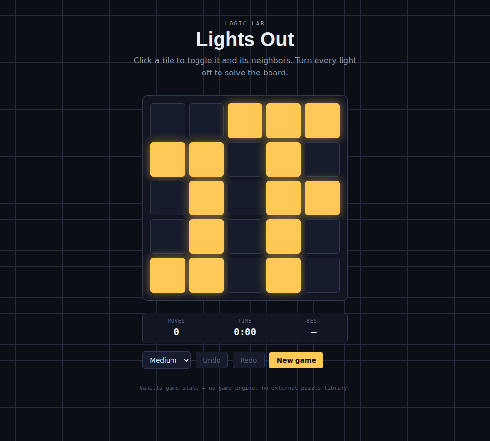

# Logic Lab — Lights Out

A Lights Out puzzle: click a tile to toggle it and its orthogonal neighbors,
turn every light off to solve the board. Includes undo/redo, a move counter,
a timer, difficulty levels, and a saved best time per difficulty.



## How it's built

The interesting part of this project isn't the puzzle itself — it's keeping
the game's state logic clean, pure, and fully covered by tests, with the
React-specific parts (rendering, timers, persistence) kept in custom hooks
separate from that logic.

## Structure

```
src/
├── types/game.ts        # Grid, GameStatus, Difficulty types
├── lib/
│   ├── grid.ts           # pure game rules: toggle, isSolved, generate a puzzle
│   └── bestTime.ts       # localStorage read/write for best completion time
├── hooks/
│   ├── useUndoRedo.ts     # generic history stack (works for any state shape)
│   ├── useTimer.ts        # elapsed-seconds counter
│   └── useLightsOut.ts    # combines the above into the actual game
├── components/
│   ├── Board.tsx
│   ├── Controls.tsx
│   └── StatusPanel.tsx
├── App.tsx
└── __tests__/
```

`lib/grid.ts` has no React, no randomness by default parameter, and no
side effects — `toggleCell`, `isSolved`, and `generateSolvablePuzzle` all
take a grid (or generation parameters) in and return a new grid out.
`useLightsOut` is where those pure functions meet actual game state:
whose move it is, whether they've won, how long they've been playing.

## The undo/redo approach

`useUndoRedo<T>` is generic — it doesn't know anything about grids or this
game specifically. It stores a history array and a pointer into it, and
`set()`, `undo()`, `redo()`, and `reset()` all just move that pointer or
mutate the array around it. `useLightsOut` uses it with `Grid` as the type
parameter, but the same hook would work for undo/redo in a text editor or a
form just as well.

## Testability

`generateSolvablePuzzle` and `useLightsOut` both accept an injectable random
source / puzzle factory instead of calling `Math.random()` directly:

```ts
generateSolvablePuzzle(size, scrambleMoves, random = Math.random)
useLightsOut({ size, scrambleMoves, puzzleFactory = generateSolvablePuzzle })
```

That's what makes the hook tests deterministic — a test can hand
`useLightsOut` a fixed starting grid and know exactly which two clicks solve
it, rather than trying to test against whatever a real random puzzle
happens to be. The puzzle generation itself is still tested separately,
including a property-style test that confirms replaying the exact moves
used to scramble a puzzle always solves it again (this works because
toggling the same cell twice cancels out).

## Testing

59 tests across 8 files, using **Jest** (not Vitest) and React Testing
Library:

- `grid.test.ts` — the pure game rules, including edge/corner toggle
  behavior and the self-inverse property above
- `useUndoRedo.test.ts` — the generic history stack in isolation
- `useTimer.test.ts` — timing behavior with fake timers
- `useLightsOut.test.ts` — the full game hook: win detection, undo/redo
  interaction with game status, best-time recording across sessions
- `Board.test.tsx`, `Controls.test.tsx`, `StatusPanel.test.tsx` — component
  rendering and interaction
- `App.test.tsx` — wiring: difficulty options render, clicking a cell
  enables Undo, New Game resets the move count

## Getting started

```bash
npm install
npm run dev     # start the dev server
npm run build   # type-check + production build
npm run test    # run the test suite once
```

## Design notes

A dark, circuit-board-style background (a fine grid of traces) with lit
tiles glowing amber — leaning into "lights" literally rather than using a
generic game UI look. The status readout (Moves / Time / Best) is styled
like a small instrument panel.

## Out of scope

- Only one puzzle type (Lights Out) — the board size is fixed at 5x5, only
  difficulty (scramble amount) changes.
- No solver/hint system — the player has no in-game help beyond undo.
- Best time is per-device (localStorage), not synced anywhere.
